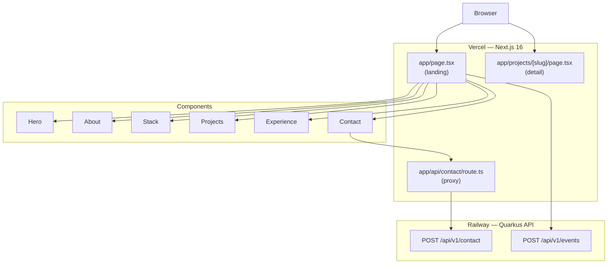

# puan-putri-portofolio

Personal portfolio for **Puan Putri Saqinah Firdaus** — AI-augmented backend engineer based in Jakarta.

Built to be credible to engineering managers, not just pretty for recruiters. Dark glassmorphism, Framer Motion animations, and a live Quarkus backend that demonstrates the exact stack it's built to advertise.

**Live:** [puanputri.dev](https://puanputri.dev) &nbsp;|&nbsp; **API:** [github.com/puanputri/portfolio-api](https://github.com/puanputri/portfolio-api)

---

## Architecture



---

## Tech Stack

| Layer | Choice |
|---|---|
| Framework | Next.js 16 (App Router) |
| Language | TypeScript (strict) |
| Styling | Tailwind CSS |
| Animations | Framer Motion |
| Icons | Lucide React |
| Forms | React Hook Form + Zod |
| Notifications | Sonner |
| Deployment | Vercel |

---

## Project Structure

```
├── app/
│   ├── api/contact/route.ts      # Proxies to Quarkus backend
│   ├── projects/[slug]/page.tsx  # Dynamic project detail pages
│   ├── layout.tsx
│   └── page.tsx                  # Landing page
├── components/
│   ├── sections/                 # Hero, About, Stack, Projects, Experience, Contact
│   ├── shared/                   # Navbar, Footer, AnimatedBg, NoiseOverlay
│   └── ui/                       # GlassCard, GradientText, MagneticButton, etc.
├── content/
│   └── projects.ts               # Project data (type-safe)
└── lib/
    └── utils.ts
```

---

## Getting Started

### Prerequisites
- Node.js 20+
- npm 10+

### Run locally

```bash
git clone https://github.com/puanputri/puan-putri-portofolio.git
cd puan-putri-portofolio
npm install --legacy-peer-deps
npm run dev
```

Open [http://localhost:3000](http://localhost:3000).

### Environment variables

Copy `.env.local.example` to `.env.local`:

```bash
cp .env.local.example .env.local
```

| Variable | Description |
|---|---|
| `CONTACT_API_URL` | Base URL of the Quarkus portfolio-api |

---

## Sections

| Section | Description |
|---|---|
| **Hero** | Name, role, Tony Stark tagline, CTA buttons |
| **About** | Personality bio, fun facts, core stack badges with hover |
| **Stack** | Grouped tech cards — Languages, Frameworks, Databases, DevOps |
| **Projects** | 3 featured cards linking to detail pages |
| **Experience** | Vertical timeline — Fajri Inc, GenAILabs, mentorship |
| **Contact** | Form proxied to Quarkus API, GitHub/LinkedIn/email links |

---

## Deployment

Deployed on **Vercel** via Git integration. Every push to `master` triggers a production deploy.

```bash
vercel --prod
```

---

## Design Decisions

**Why Next.js App Router?**
Server Components reduce JS bundle size for sections that don't need interactivity (About, Experience). Only animated sections use `'use client'`.

**Why Framer Motion over CSS animations?**
`whileInView` with `once: true` gives scroll-triggered reveals with a single prop — no IntersectionObserver boilerplate. Magnetic button effect requires spring physics that CSS can't express cleanly.

**Why a real Quarkus backend instead of a serverless function?**
The portfolio targets backend engineering roles. Having a live Quarkus microservice handling the contact form is a working demonstration of the stack being advertised.
